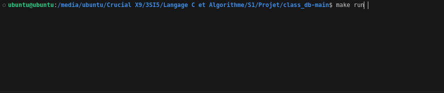
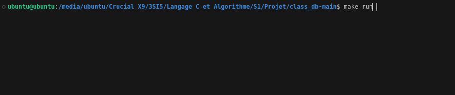

# Small Database Project in C

This project is a simple database in C with a command-line interface (REPL). It allows you to insert, select, and update entries. The project uses a Makefile to simplify compilation and execution.

## Features

- **INSERT**: Adds an entry to the database.  
  - Syntax: `insert <id> <name>`
    
   
  
- **SELECT**: Displays all entries or a specific entry by ID.  
  - Syntax without argument: `select`  
  - Syntax with a specific ID: `select <id>`
    
  
  
- **UPDATE**: Updates a specific entry based on the ID.  
  - Syntax: `update <id> <name>`
    
  
  
- **.exit**: Exits the REPL program.  
  - Syntax: `.exit`

## Data Customization

It is possible to modify the type of data used in the database. By default, the project uses three fields: an **Id** and a **name**. However, you can modify or adapt these fields to suit your requirements.

## Prerequisites

- **Make**: Ensure you have `make` installed to compile and run the program.

## Installation and Compilation

1. **Clone the project**:
   ```bash
   git clone <your_github_repository_url>
   cd <project_folder_name>
### Récapitulatif des commandes :

- **`make`** : Compiles the project to generate the executable.
  
- **`make run`** : Compiles and launches the REPL program to interact with the database.
  
- **`make clean`** : Cleans up the directory by removing the files generated during compilation (like the executable).

- **`make test`** : Runs unit tests to verify the various functions of the program.
You are not required to run `make test` unless necessary. This command can edit the persistence file `table_data.dat`, which contains the saved data of the database. If you want to test the program's features without the risk of data modification, it is recommended to use `make run`to interact with the command-line interface. This allows you to test features without impacting data persistence.
- **`make valgrind`** : Use memcheck which is a memory leak detector. To use it, you will first need to install valgrind with the following command : `sudo apt-get install valgrind` 
